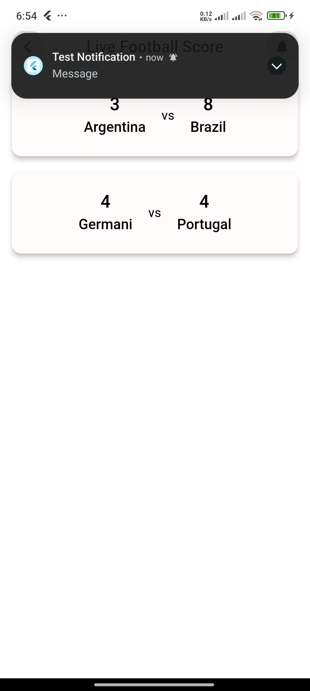

# Live Football Score App

A live football score app with firebase and getx.

# The technology I used to make this App.

<ol>
    <li>
        Using GetX state management(Obx).
    </li>
    <li>
        Used Firebase Firestore Database.
    </li>
    <li>
        Used firebase data auto listening functionality.
    </li>
    <li>
        Used Firebase push notification.
    </li>
    <li>
        Used GoRouter for manage route.
    </li>
</ol>

## Screenshots

    
    

A few resources to get you started if this is your first Flutter project:

- [Lab: Write your first Flutter app](https://docs.flutter.dev/get-started/codelab)
- [Cookbook: Useful Flutter samples](https://docs.flutter.dev/cookbook)

For help getting started with Flutter development, view the
[online documentation](https://docs.flutter.dev/), which offers tutorials,
samples, guidance on mobile development, and a full API reference.
